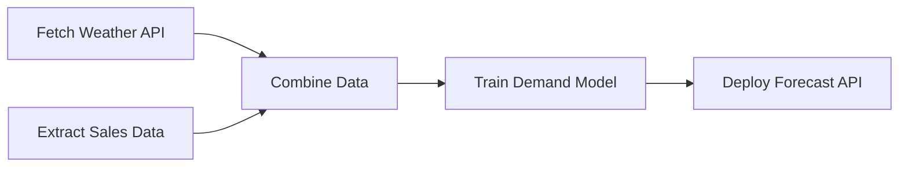

# 🔄 Data Pipelines & Workflow Orchestration — Architecture & Airflow Guide

**Author:** Youssef Ibrahim Mohamed Soliman
**GitHub:** https://github.com/Yosef-Ibrahim
**Email:** youssefibrahimelisely@gmail.com
**Phone:** 01119834356

> Have an idea, correction, or new example to contribute (ML / Data Science / Data Analysis / Data Engineering topics only)? Reach out using the contact info above.
>
> 📖 Source: *Data Pipelines & Apache Airflow* course material (Rowad Misr Al-Raqmeya).

---

## 📑 Table of Contents
1. [Core Definitions (Pipeline, Orchestration, DAG)](#1-core-definitions)
2. [Graph Theory in Pipelines & Circular Deadlocks](#2-graph-theory-in-pipelines--circular-deadlocks)
3. [The DAG Execution Engine Algorithm](#3-the-dag-execution-engine-algorithm)
4. [Sequential Scripts vs. Orchestrated DAGs](#4-sequential-scripts-vs-orchestrated-dags)
5. [Apache Airflow Architecture (Webserver, Scheduler, Metadata DB, Workers)](#5-apache-airflow-architecture)
6. [Airflow Workloads: Operators, Sensors & TaskFlow API](#6-airflow-workloads-operators-sensors--taskflow-api)
7. [Dependency Control Flow & XCom Data Passing](#7-dependency-control-flow--xcom-data-passing)
8. [Airflow vs. dbt (Orchestration vs. Transformation)](#8-airflow-vs-dbt-orchestration-vs-transformation)

---

## 1) Core Definitions

### A) Data Pipeline
An end-to-end automated process that extracts raw data from multiple sources, applies cleaning/transformation, and loads it into target analytical destinations (Data Warehouses, Data Lakes, ML models).

### B) Data Orchestration
The centralized automation framework that manages, schedules, and monitors multi-stage data pipelines across an enterprise data ecosystem.

### C) Directed Acyclic Graph (DAG)
A mathematical graph consisting of **nodes** (individual tasks) and **directed edges** (dependencies) with no closed loops (acyclic).



---

## 2) Graph Theory & Circular Deadlocks

In a pipeline graph, dependencies enforce execution order. If a graph contains a **cycle** (e.g., Task 2 depends on Task 3, which depends on Task 2), a **circular dependency deadlock** occurs: neither task can ever start.

```
❌ Cyclic Graph (Deadlock):
Task 1 ----> Task 2 <----> Task 3 (Infinite Wait!)

✅ Directed Acyclic Graph (DAG):
Task 1 ----> Task 2 ------> Task 3 (Orderly Execution)
```

---

## 3) The DAG Execution Engine Algorithm

Orchestration engines (like Apache Airflow) execute DAGs using a continuous dependency checking loop:

1. **Scan Open Tasks**: Identify all uncompleted tasks in the DAG.
2. **Check Upstream Edges**: For each open task, verify if all immediate upstream predecessor tasks are marked as `SUCCESS`.
3. **Queue Ready Tasks**: If all upstream dependencies are satisfied, place the task into the execution queue.
4. **Worker Execution**: Worker nodes pick up queued tasks, execute the code, and update task status in the Metadata DB.
5. **Loop**: Repeat until all tasks in the DAG reach a terminal state (`SUCCESS` or `FAILED`).

---

## 4) Sequential Scripts vs. Orchestrated DAGs

| Feature | Monolithic Sequential Scripts (Python/Bash) | Orchestrated Pipeline Graphs (DAGs) |
|---|---|---|
| **Execution Flow** | Rigid linear execution step-by-step | Parallel execution along independent graph branches |
| **Dependencies** | Implicit in code sequence | Explicitly declared (`task1 >> task2`) |
| **Failure Recovery** | Cascading failure; requires full script restart | Task-level retry & incremental partial re-runs |
| **Visibility** | Log searching only | Rich visual DAG UI & Gantt execution charts |
| **Scalability** | Single server bottleneck | Distributed across worker pools (Celery / Kubernetes) |
| **Tools** | Cron, raw scripts | Airflow, Dagster, Prefect, Kubeflow |

---

## 5) Apache Airflow Architecture

Apache Airflow originated at Airbnb in 2014 (created by Maxime Beauchemin) based on the philosophy of **Workflows as Code** written in Python.

```
                    +-------------------+
                    |   User / Web UI   |
                    +---------+---------+
                              |
                              v
+---------------+   +---------+---------+   +-------------------+
| DAG Directory |-->|  Airflow Scheduler|-->| Metadata Database |
+---------------+   +---------+---------+   |  (PostgreSQL/MySQL|
                              |             +-------------------+
                              v
                    +---------+---------+
                    |  Worker Nodes     |
                    +-------------------+
```

### Core Components
1. **Webserver**: Flask-based UI for monitoring DAG runs, inspecting logs, and triggering runs.
2. **Scheduler**: High-performance daemon that parses the DAG directory, tracks dependencies, and submits ready tasks to the Executor.
3. **Metadata Database**: Stores task states, DAG runs, variables, and connections.
4. **Executor**: Strategy for executing tasks (`LocalExecutor`, `CeleryExecutor`, `KubernetesExecutor`).
5. **Workers**: Processes that run the actual task code.

---

## 6) Airflow Workloads: Operators & TaskFlow API

### A) Classic Operators
* **`PythonOperator`**: Executes a Python callable.
* **`BashOperator`**: Executes bash scripts or CLI commands.
* **`Sensors`**: Special operators that wait/poll for external events (file arrival, HTTP 200, SQL table row).

### B) TaskFlow API (`@task`)
Modern Airflow syntax using Python decorators:

```python
from datetime import datetime, timedelta
from airflow import DAG
from airflow.decorators import task

default_args = {
    'owner': 'data_engineering',
    'depends_on_past': False,
    'retries': 2,
    'retry_delay': timedelta(minutes=5)
}

with DAG(
    dag_id='weather_demand_pipeline',
    default_args=default_args,
    start_date=datetime(2026, 1, 1),
    schedule_interval='@daily',
    catchup=False
) as dag:

    @task()
    def fetch_weather():
        return {'city': 'Cairo', 'temp_c': 32}

    @task()
    def fetch_sales():
        return {'umbrella_sales': 150}

    @task()
    def combine_and_predict(weather_data, sales_data):
        print(f"City: {weather_data['city']}, Sales: {sales_data['umbrella_sales']}")
        return "Model Trained Successfully"

    # Dependency Graph & implicit XCom data pass
    weather = fetch_weather()
    sales = fetch_sales()
    combine_and_predict(weather, sales)
```

---

## 7) Dependency Control Flow & XComs

### Bitshift Operators (`>>` and `<<`)
```python
task_start >> [fetch_weather_task, fetch_sales_task] >> combine_task >> task_end
```

### XComs ("Cross-Communications")
XComs allow tasks to exchange small pieces of metadata (JSON serializable, usually < 48KB) via the Airflow Metadata DB. For large datasets (Gigabytes/Terrabytes), tasks pass cloud storage URIs (`s3://...` or `adls://...`) via XCom rather than passing full data payloads.

---

## 8) Airflow vs. dbt

```
+-------------------------------------------------------------------+
|                          APACHE AIRFLOW                           |
|  (Orchestrates overall workflow, Cloud Infrastructure, Spark, dbt)|
|                                                                   |
|   [Extract API] >> [Load Data Lake] >> [Trigger dbt] >> [ML Model]|
|                                             |                     |
|                                             v                     |
|                                     +---------------+             |
|                                     |      dbt      |             |
|                                     | (SQL Models   |             |
|                                     | in Data W/H)  |             |
|                                     +---------------+             |
+-------------------------------------------------------------------+
```

| Feature | Apache Airflow | dbt (data build tool) |
|---|---|---|
| **Primary Role** | Workflow Orchestration & Scheduling | In-Warehouse Data Transformation |
| **Language** | Python | SQL + Jinja Templating |
| **Execution Scope** | System-wide (DBs, APIs, Spark, Docker, Cloud) | Data Warehouse Internal Queries (Snowflake/BigQuery) |
| **Integration** | Airflow triggers dbt jobs | dbt runs transformations defined by Airflow |

---

## 📬 Contributing

Have an addition, correction, or idea for this reference (ML / Data Science / Data Analysis / Data Engineering topics only)? Get in touch:

- **Youssef Ibrahim Mohamed Soliman**
- 📱 01119834356
- 📧 youssefibrahimelisely@gmail.com
- 💻 https://github.com/Yosef-Ibrahim
