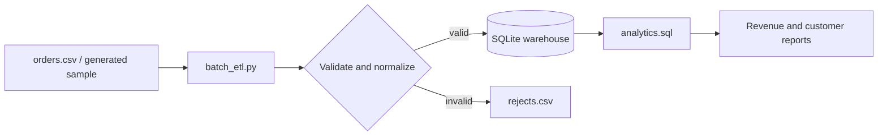

# 01 — E-commerce Batch ETL

**Author:** Youssef Ibrahim Mohamed Soliman  
**GitHub:** https://github.com/Yosef-Ibrahim  
**Email:** youssefibrahimelisely@gmail.com  
**Phone:** 01119834356

This project implements a small, idempotent order pipeline. CSV orders are
validated, normalized, and loaded into SQLite; analytical SQL then produces
daily revenue and customer metrics. SQLite and the Python standard library are
the default runtime, so the example is safe to run offline.

## Architecture



The production analogue can replace the CSV source with object storage and
SQLite with PostgreSQL, Snowflake, or BigQuery without changing the
validation contract.

## Prerequisites

- Python 3.10 or newer.
- Basic CSV, relational modeling, and SQL knowledge.
- No third-party package is required for the script or SQL.
- Optional: Jupyter for `batch_etl.ipynb` and a SQL client for exploration.

## Study checklist

1. Read [schema_ddl.sql](./schema_ddl.sql) and identify fact, dimension, and
   audit tables.
2. Trace the `extract -> validate -> transform -> load` functions in
   [batch_etl.py](./batch_etl.py).
3. Run the pipeline twice and verify that the primary-key upsert does not
   duplicate orders.
4. Change one input row to an invalid quantity and inspect `rejects.csv`.
5. Explain why `analytics.sql` uses a half-open date range for timestamps.

## Run locally

```powershell
cd "data-engineering\projects\01-ecommerce-batch-etl"
python batch_etl.py --demo --database ecommerce.db
```

The command creates a small `orders.csv` when `--demo` is selected, applies
the DDL, writes `ecommerce.db`, and records rejected rows in `rejects.csv`.
Use a real file with:

```powershell
python batch_etl.py --input orders.csv --database ecommerce.db
```

Inspect the report with SQLite:

```powershell
sqlite3 ecommerce.db ".read analytics.sql"
```

The notebook contains the same flow as executable, explanatory cells. It is
intentionally not executed in the repository, keeping the checkout small and
free of generated database files.

## Input contract

Required columns are `order_id`, `customer_id`, `order_ts`, `product_id`,
`quantity`, `unit_price`, and `currency`. Timestamps must be ISO-8601,
quantity must be a positive integer, and unit price must be non-negative.
Malformed records are rejected rather than silently coerced.

## Production extensions

- Store a source-file checksum and ingestion batch ID for replayability.
- Add a quarantine table and data-quality metrics.
- Partition object storage by `order_date`; use a warehouse `MERGE`.
- Add orchestration retries, schema evolution policy, and SLA monitoring.

📬 **Contributing:** Suggestions and corrections are welcome via
[GitHub](https://github.com/Yosef-Ibrahim).
