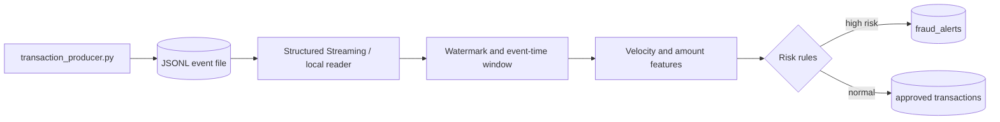

# 02 — Realtime Fraud Detection

**Author:** Youssef Ibrahim Mohamed Soliman  
**GitHub:** https://github.com/Yosef-Ibrahim  
**Email:** youssefibrahimelisely@gmail.com  
**Phone:** 01119834356

This project demonstrates an event-driven fraud detector. A credential-free
producer writes deterministic JSON Lines transactions, while the detector
shows both a local standard-library mode and an optional Spark Structured
Streaming implementation. The local mode is useful before installing Spark;
the Spark path documents the production-shaped design.

## Architecture



The same event contract can be delivered by Kafka, Kinesis, or Event Hubs.
The example deliberately does not connect to any of them.

## Prerequisites

- Python 3.10 or newer for the producer and local detector.
- Optional: Java and PySpark 3.4+ for the Spark script/notebook.
- Familiarity with JSON Lines, event time, windows, and false positives.
- No account, API key, or network service is required.

## Study checklist

1. Generate transactions and inspect `event_id`, `event_ts`, and `device_id`.
2. Run the local detector and explain each alert reason.
3. Read the Spark version and locate the watermark, aggregation, and
   checkpoint settings.
4. Discuss why event time and a late-data policy matter more than processing
   time for a fraud decision.
5. Design a replay strategy that does not emit duplicate alerts.

## Run locally

```powershell
cd "data-engineering\projects\02-realtime-fraud-detection"
python transaction_producer.py --output transactions.jsonl --count 25 --seed 7
python spark_fraud_detector.py --input transactions.jsonl --output fraud_alerts.jsonl
```

The default detector uses a local rule engine and produces explainable
JSONL alerts. It has no external imports. To use Spark against a streaming
directory, install PySpark separately and run the script with `--spark`:

```powershell
mkdir input
python transaction_producer.py --output input\transactions.jsonl --count 100
python spark_fraud_detector.py --spark --input input --output checkpoints\fraud
```

Spark writes a streaming query and requires a checkpoint directory. The
notebook mirrors the Spark transformations as a study artifact; it is valid
JSON and is not executed during checkout validation.

## Detection contract

The teaching rules flag high-value transactions, rapid repeated activity for
one card, and a country change in a short window. These are illustrative
signals, not a financial decision system. Real deployments require labeled
data, model governance, privacy controls, analyst review, and threshold
calibration.

## Production extensions

- Use a durable broker and schema registry with compatibility checks.
- Make `event_id` the idempotency key for sinks and alert notifications.
- Add model features, feature-store freshness checks, and drift monitoring.
- Encrypt data in transit and at rest; minimize and tokenize payment data.

📬 **Contributing:** Suggestions and corrections are welcome via
[GitHub](https://github.com/Yosef-Ibrahim).
