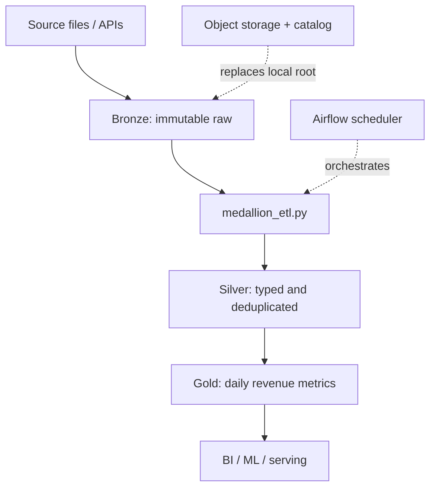

# 03 — Cloud Lakehouse Medallion

**Author:** Youssef Ibrahim Mohamed Soliman  
**GitHub:** https://github.com/Yosef-Ibrahim  
**Email:** youssefibrahimelisely@gmail.com  
**Phone:** 01119834356

This project shows how a cloud-ready lakehouse separates raw ingestion
(bronze), cleaned conformed data (silver), and business aggregates (gold).
The runnable implementation uses local directories and CSV/JSON so it needs
no cloud credentials. The Airflow DAG is optional and only imports Airflow
when the scheduler parses it.

## Architecture



Bronze is replayable, silver is trustworthy, and gold is optimized for
consumption. The boundary between layers is also a useful data-quality and
ownership boundary.

## Prerequisites

- Python 3.10 or newer.
- Basic object-storage, partitioning, and dimensional-modeling concepts.
- Optional: Apache Airflow 2.6+ to parse and schedule `airflow_dag.py`.
- No cloud account or credentials are needed for the local walkthrough.

## Study checklist

1. Run the local pipeline and inspect each layer before reading the code.
2. Identify which transformations are safe to repeat.
3. Explain why a gold table should not be the only copy of source data.
4. Read the Airflow dependencies and map them to the diagram.
5. Replace the local root with an `s3://`, `abfss://`, or `gs://` prefix only
   after adding an authenticated filesystem adapter.

## Run locally

```powershell
cd "data-engineering\projects\03-cloud-lakehouse-medallion"
python medallion_etl.py --input sample_events.jsonl --root lakehouse
```

If `sample_events.jsonl` does not exist, the script creates a small deterministic
sample. It writes `bronze/`, `silver/`, and `gold/` below `lakehouse/`, plus a
run manifest containing row counts and UTC completion time. Re-running the
command uses stable event IDs and replaces derived outputs safely.

To inspect the Airflow DAG in an Airflow environment:

```powershell
set AIRFLOW_HOME=%CD%\airflow-home
airflow dags list
airflow dags test cloud_lakehouse_medallion 2026-01-01
```

Airflow is intentionally not required to run `medallion_etl.py`; the DAG uses a
Python task and passes only paths/configuration, not credentials.

## Cloud mapping

| Local example | Typical cloud equivalent |
|---|---|
| `lakehouse/bronze` | Object storage raw prefix |
| `lakehouse/silver` | Delta/Iceberg/Hudi table |
| `lakehouse/gold` | Lakehouse table or warehouse serving schema |
| JSONL/CSV | Parquet with an enforced schema |
| Manifest JSON | Catalog, audit table, and lineage metadata |

## Production extensions

- Use Delta/Iceberg/Hudi transactions for atomic commits and time travel.
- Add catalog permissions, PII classification, retention, and lineage.
- Partition by event date, compact small files, and enforce schema evolution.
- Make orchestration retries, backfills, and data-quality gates explicit.

📬 **Contributing:** Suggestions and corrections are welcome via
[GitHub](https://github.com/Yosef-Ibrahim).
